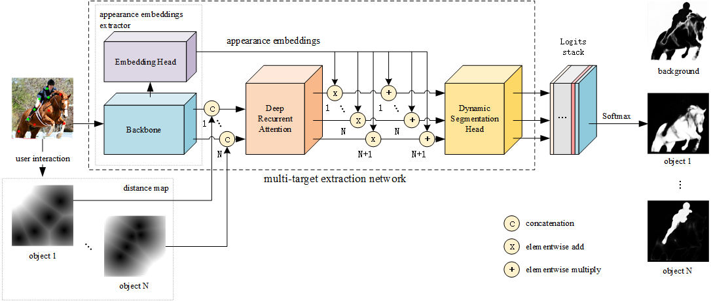

<!--
 * @Author       : Bingqiang Zhou
 * @Date         : 2022-01-14 12:42:13
 * @LastEditors  : Bingqiang Zhou
 * @LastEditTime : 2022-05-05 04:08:51
 * @Description  : 
-->
# Learning Interactive Multi-Object Segmentation

## 1. Paper

**"Yan Gui, Bingqing Zhou, Jianming Zhang, Cheng Sun, Lingyun Xiang, Jin Zhang. Learning Interactive Multi-Object Segmentation through Appearance Embedding and Spatial Attention, Submitted to IET Image Processing, 2021."**

Overall architecture of Interactive Multi-Object Segmentation Network, as shown below.



experimental result data (.xlsx) in our paper：[experimental_results.zip](https://github.com/BingqiangZhou/Learning-Interactive-Multi-Object-Segmentation/releases/tag/experimental-results)

## 2. Run Demo App

### 2.1 Download [model file](https://github.com/BingqiangZhou/Learning-Interactive-Multi-Object-Segmentation/releases/download/model/best_mean_iou_epoch.pkl), and put it to `models` folder.

### 2.2 config python env，install dependent packages and run deom .

```bash
## 1. create conda virtual env.
conda create -n mos python=3.6

## 2. activate conda virtual env.
conda activate mos

## 3. install pytorch, reference url: https://pytorch.org.
conda install pytorch torchvision cudatoolkit=10.2 -c pytorch

## 4. install other dependent packages.
conda install matplotlib=3.2 opencv-python scikit-learn yacs loguru tensorboard

## 5. select GPU or CPU to inference.
modify the value of "device_num" in file "./demo/args.py", for CPU，set "device_num" to number less than 0, for GPU, set "device_num" to the Number of GPU.

## 6. into the workspaces of demo.
cd ./demo

## 7. run demo app by python file. (if you use ssh connect linux server to run deme app, you can skip this step, see 7-th step).
python demo.py

## 8. run demo app by jupyter notebook (you need run `conda install -c conda-forge notebook` to install jupyter notebook), and then run the last cell of `Demo.ipynb`.
```

How to Segmentation, you can see **chapter 2.3**

### 2.3 **Segmentation Demo**

**operation:**

- mouse:
  - [left button]：interacte
  - [right button]：cancel last interactation
- keyboard:
  - [number key, include 1-9]: n-th object mark
  - ['p' key]: predict result when not in "auto predict" mode
  - ['ctrl' + 'alt' + 's' key]：save result inlcude predict label, embedding map(random projection), visual attention map
  - ['c' key]: change mode, 'auto predict' or 'press 'p' to predict'
  - ['b' key]: change to before image
  - ['a' key]: change to after image
  - ['r' key]:  reset interaction


## 3. Train

### 3.1 Download [VOC2012](http://host.robots.ox.ac.uk/pascal/VOC/voc2012/) dataset and extract files

```bash
wget -c http://host.robots.ox.ac.uk/pascal/VOC/voc2012/VOCtrainval_11-May-2012.tar

tar -xvf VOCtrainval_11-May-2012.tar
```

### 3.2 modify config file

setting the path of voc2012 and whether use GPU in `./config/MOS.yaml`.

```bash
# line 8-9
BASIC:
  USE_GPU: True
  GPU: 0

# line 21
DATASET:
  DATASET_ROOT_FOLDER:
```

### 3.3 run main.py

```bash
python main.py -c ./config/MOS.yaml 
```

## 4. Test

### 4.1 generate interactive pairs

```bash
# 1. install refernece package
pip install tqdm pandas

# 2. run generate_interactive_pairs.py
python generate_interactive_pairs.py
```

### 4.2 test Our-S and Our-M

```bash
# 1. setting the path of voc2012 to 'voc_root_dir' 

# 2. setting the path of interaction generated to 'interactives_dir'

# 3. test Our-S
python test_voc_singal_object.py

# 4. test Our-M
python test_voc_mutli_object.py
```


====================================================

Email: bingqiangzhou@qq.com (Bingqiang Zhou)
